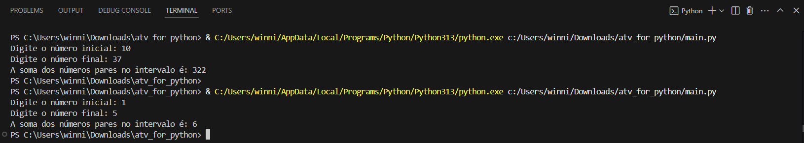

# AtividadeFor

Foi realizada uma atividade para calcular a soma dos números pares dentro de um intervalo determinado pelo usuário, com dois números inteiros, representando o início e o fim do intervalo.
Onde foi utilizado um loop "for" sobre todos os números no intervalo para somar apenas os números pares e exibir o valor final.
Também tem a estrutura "else" para exibir uma mensagem indicando que não há números pares no intervalo, caso isso ocorra.

